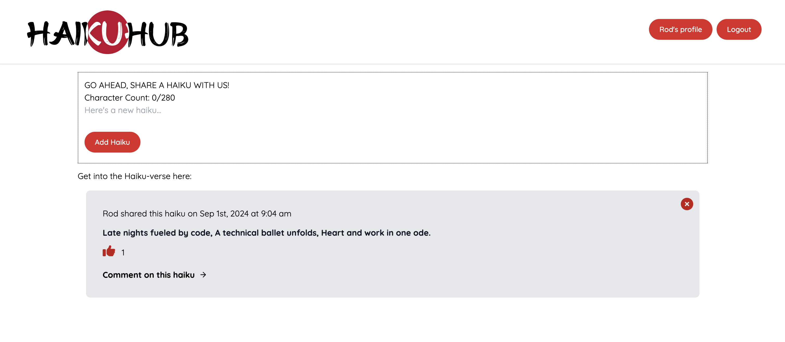

 

<h1 align="center">HaikuHub</h1>

<i>Get into the haiku-verse</i>

  

 

## **ABOUT THE PROJECT**
### **Overview**

***HaikuHub***, your go-to place for all things haiku. Our simple, elegantly designed platform for haiku enthusiasts allows you to create, share, and discover haikus. Whether you're a seasoned poet or just beginning to explore the art of haiku, HaikuHub offers a welcoming community where your words can find their audience.

*Find the repo [here](https://github.com/Rod-Freedom/HaikuHub).* 
*Go to the site [here](https://haikuhub.onrender.com/)!*

 
 

## Table of Contents
- [License](#license)
- [Resources](#resources)
- [Get Started](#get-started)
- [Usage](#usage)
- [Demos](#demos)
- [Testing](#testing)
- [Contribute](#contribute)
- [Credits](#credits)

 

[(Back to the Top)](#about-the-project)

## Resources
* React
* GraphQl
* MongoDB
* Node
    * npm packages
        * Mongoose
        * bcrypt
        * Express.js

 

[(Back to the Top)](#about-the-project)

## Get Started
No installation is required, just go to the site [here](https://haikuhub.onrender.com/) and explore HaikuHub!

 

[(Back to the Top)](#about-the-project)

## Usage
**HaikuHub** is easy and intuitive to use.

Once you've entered the site, click `Login` and you'll be directed to the login/sign-up page.

Once you've created a user, you're ready to start haikubing.

Click `Add Haiku` anytime. You can comment and like haikus. If you like another user's input, just click on their profile names and read more of 'em!

You can delete your own haikus by clicking on the `x` in the top right corner.

> 

 

[(Back to the Top)](#about-the-project)

## License
 
See the [license](https://github.com/Rod-Freedom/HaikuHub/blob/main/LICENSE) for more details.

 

[(Back to the Top)](#about-the-project)

## Contribute
If you have suggestions or want to help with some improvements, you can write us by [email](mailto:rod@alpacaazul.mx).

 

[(Back to the Top)](#about-the-project)

## Credits
This site was created by `Cross Guild Org`. The contributors are: [Gabrielasiu](https://github.com/Gabrielasiu), [VanZittle](https://github.com/vanzittle), [dvdfml](https://github.com/dvdfml) and [Rod's Freedom](https://github.com/Rod-Freedom).

 

[(Back to the Top)](#about-the-project)